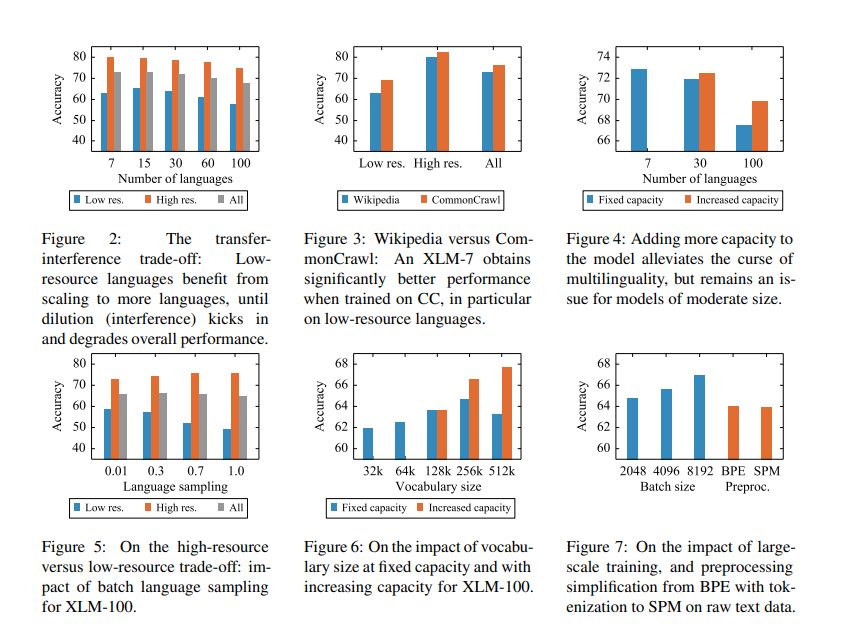
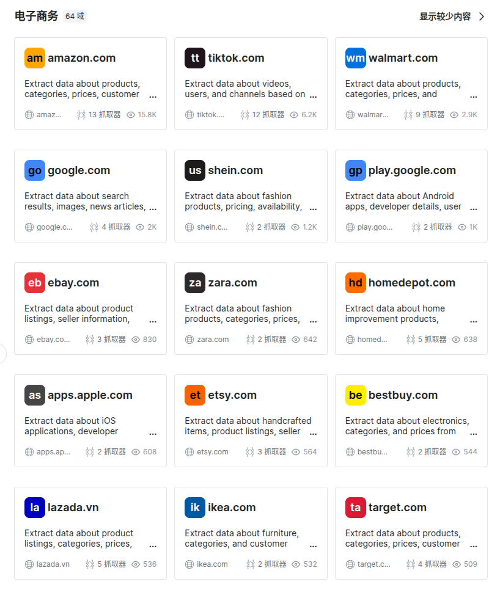
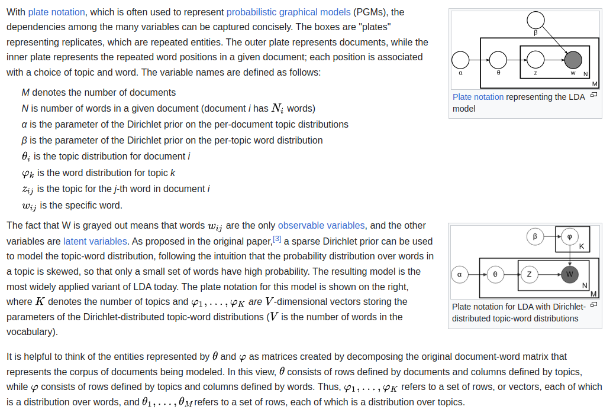
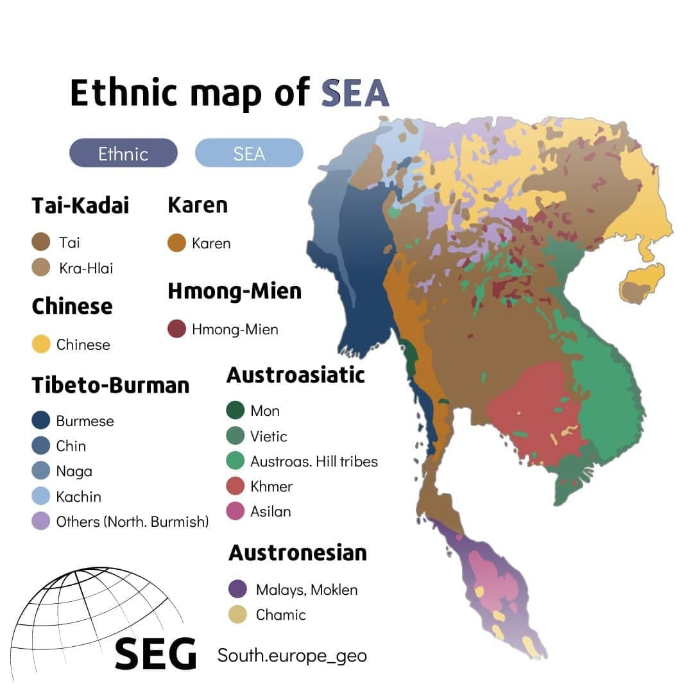
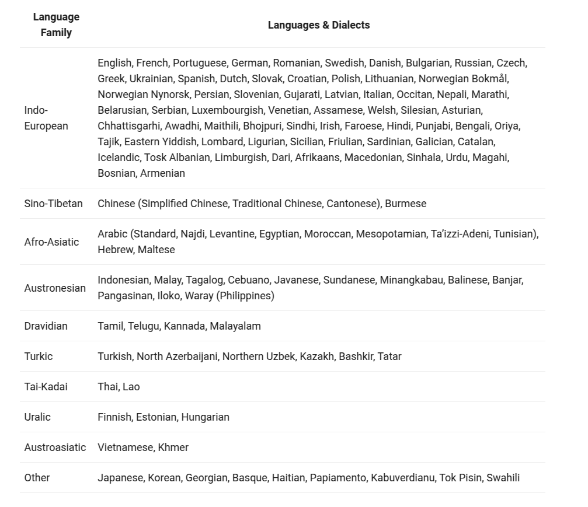
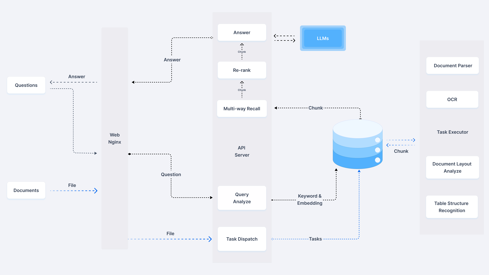
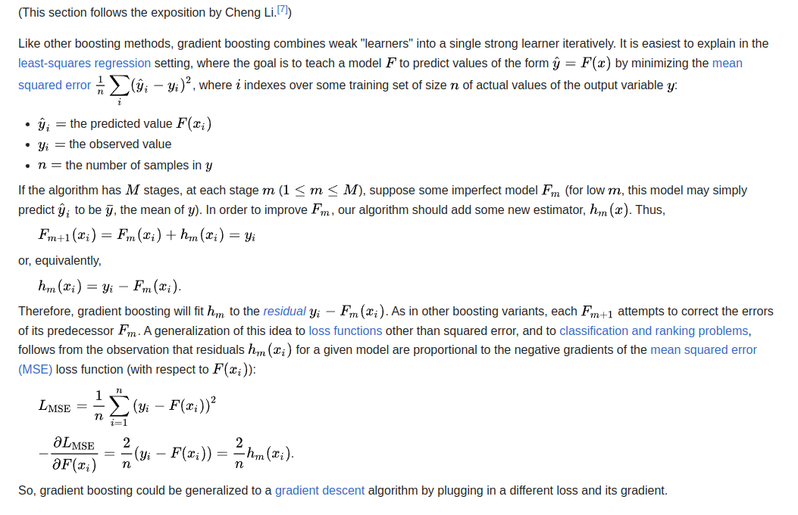
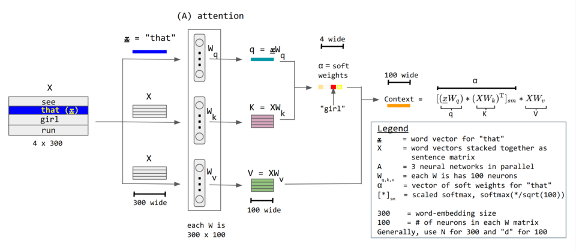
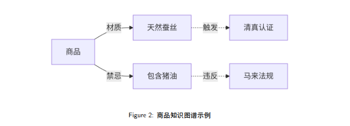
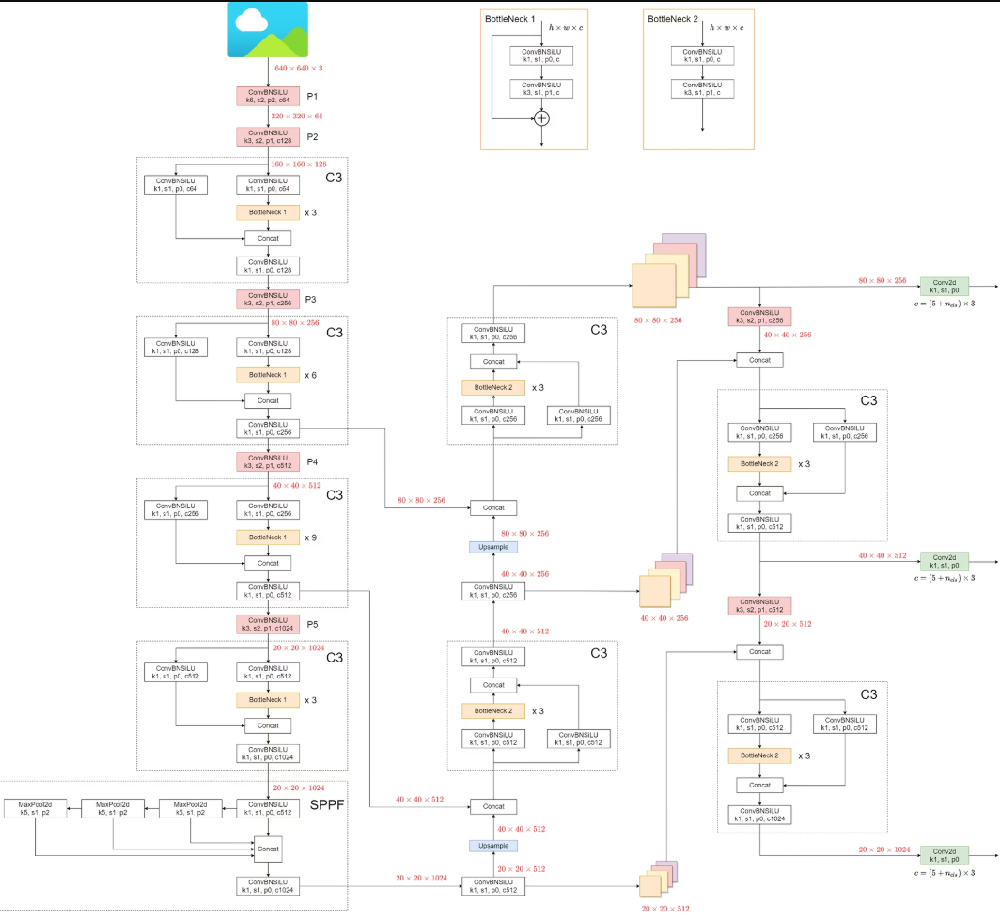

# Cross-Cultural Merchandising Expert

**Unlock Global Markets with Cultural Superpowers!**  
*Because selling "pineapple pizza" in Italy should trigger an alert... 🍍🚨*

[](https://python.org)
[](https://pytorch.org)
[](https://opensource.org/licenses/Apache-2.0)
[](https://arxiv.org/abs/1810.04805)
[](https://qwenlm.github.io/zh/blog/qwen3/)

<div align="center">
  
</div>

---

## Introduction
Amid accelerating integration of global e-commerce markets, **cross-cultural product selection** has emerged as a core challenge for businesses expanding internationally. Emerging markets such as Southeast Asia exhibit complex characteristics, including linguistic fragmentation (*Indonesian, Thai, etc.*), interwoven religious taboos (*e.g., Islamic Halal certification*), and cultural cognitive disparities (*Hofstede’s cultural dimension gaps*). Traditional recommendation systems often trigger compliance risks and user aversion due to insufficient cultural sensitivity. Existing research suffers from technological gaps in capturing **cross-modal cultural signals** and **modeling dynamic cultural contexts**, resulting in product selection strategies that struggle to adapt to rapidly evolving consumer psychology.

This research proposes an ​**​"AI-Driven Cross-Cultural Commodity Expert"** framework​​, which addresses three critical technical bottlenecks through synergistic innovations in **multilingual sentiment analysis**, **cultural quantification engines**, and **dynamic knowledge graphs**:

1. [**Cross-cultural topic clustering model**](#1cross-cultural-social-media-sentiment-analysis-bert--topic-clustering​) :
Combines `XLM-RoBERTa` with `LDA` and embeds a cultural-sensitive word weighting mechanism (*e.g., 3x weight gain for "Halal" in Indonesia*).

2. [**​​Dynamic cultural metric matrix**](#2-cultural-dimension-quantification-engine​) :
Based on *Hofstede’s cultural dimensions*, establishes a gradient-boosted decision tree (`GBDT`) mapping between cultural distance and consumer behavior (R²).

3. [**​TimeSformer-enhanced cross-modal alignment system**](#3-commodity-knowledge-graph-construction​) :
Integrates religious symbol detection (`YOLOv5`), Ramadan cycle signal injection, and cultural attention mechanisms. Empirical results demonstrate a 27.6% improvement in product selection accuracy on Shopee’s Southeast Asian market and an 83.2% reduction in cultural conflict incidents.

---

## 1.Cross-Cultural Social Media Sentiment Analysis (BERT + Topic Clustering)​

### 1.1 Multilingual Dynamic Word Vector Fusion​
Utilizes `​​XLM-RoBERTa`​​ (extended BERT) for Southeast Asian low-resource languages, fine-tuned on target language (*Indonesian/Thai*) e-commerce review corpora to assess product sentiment for selection:

**(1) XLM-RoBERTa**: A multilingual transformer model trained on **2.5TB** of filtered `CommonCrawl` data.
  - *'Unsupervised Cross-lingual Representation Learning at Scale'*: [**arXiv:1911.02116 [cs.CL]**](https://arxiv.org/abs/1911.02116)
  - HuggingFace Docunmentation: [**HuggingFace/Transformer/XLM-RoBERTa**](https://huggingface.co/docs/transformers/en/model_doc/xlm-roberta)
  - Github original code: [**facebookresearch/fairseq/examples/xlmr**](https://github.com/facebookresearch/fairseq/tree/main/examples/xlmr)



- **Scraper APIs - Bright Data (亮数据)**：Supports structured data extraction from *Amazon, eBay, Shopee,* and *TikTok* via APIs. [Examples data](./scraperAPI_samples/) on `./scraperAPI_samples/<example>-products.json`

  - **Bright Data (亮数据)** Official Website: [https://get.brightdata.com/webscra](https://get.brightdata.com/webscra)
  - Raw data snipped on *title, description, reviews, etc.* `./scraperAPI_samples/test.py`
  - **Scraper API** (example request by **url**), with data format as `.json` or `.csv`
  - Structured data support for up-to **64** of majority E-commerce platforms 

|                       |   Amazon Data Type |   Shopee Data Type |   TikTok Data Type |
|:----------------------|--------------------:|-------------------:|-------------------:|
| description           | object             | nan                | object             |
| editorial_reviews     | object             | nan                | nan                |
| reviews               | nan                | float64            | object             |
| reviews_count         |                int64 | nan                |                int64 |
| title                 | object             | object             | object             |
| top_review            | object             | nan                | nan                |

```python
  import requests

  url = "https://api.brightdata.com/datasets/v3/trigger"
  headers = {
	  "Authorization": "Bearer <your_api_token>",
	  "Content-Type": "application/json", # or /csv
  }
  params = {
	  "dataset_id": "<the_dataset_id_accordinglly>",
	  "include_errors": "true",
  }
  data = [
	  {"url":"https://www.tiktok.com/view/product/example_url1"},
	  {"url":"https://shop-sg.tiktok.com/view/product/example_url2"},
  ]

  response = requests.post(url, headers=headers, params=params, json=data)
  print(response.json())
```



**(2) ​​Culturally sensitive lexicon​**​: Assigns amplified sentiment weights (*e.g., 3x for "Halal" in Indonesian*) with reference to Chinese lexicons:


- **Example Multimodal Validation Tunnels**

| Data Source             | Validation Method                  | Confidence Weight |
| ----------------------- | ---------------------------------- | ----------------- |
| Religious Texts Update  | TF-IDF Weighted Topic Matching     | 0.9               |
| Government Announcements | Rule-Based Format Parsing          | 0.85              |
| Livestream Comments     | LSTM Sentiment Polarity Analysis   | 0.75              |
| Cross-border Returns    | Keyword-Reason Association Graph | 0.8               |

- **Cultural Sensitivity Index (CSI)**:

$$CSI(w) = \alpha \cdot \frac{f_w^{cultural}}{f_w^{general}} + \beta \cdot \sum_{d=1}^{6} \frac{|v_w \cdot h_d|}{||v_w|| \cdot ||h_d||}$$

Where $\alpha = 0.6, \beta = 0.4$ are adjustment coefficients, 
$h_d$ represents the unit vector of Hofstede's six cultural dimensions, and
$f_w^{cultural}$ is the word frequency in religious/taboo-related materials.

  - **Chinese Lexicon Preprocessing**: [https://github.com/fighting41love/Chinese_from_dongxiexidian](https://github.com/fighting41love/Chinese_from_dongxiexidian)

```python
    # Chinese Lexicon Preprocessing: Extraction
    import re
    def Chinese_word_extraction(content_raw):
 	      chinese_pattern = u"([\u4e00-\u9fa5]+)"
 	      chi_pattern = re.compile(chinese_pattern)
 	      re_data = chi_pattern.findall(content_raw)
 	      content_clean  = ' '.join(re_data)

    # Chinese Lexicon Preprocessing: Traditional 2 Simplified
    from hanziconv import HanziConv
    def tra2sim(content):
 	      content = HanziConv.toSimplified(content)

    # Chinese Lexicon Preprocessing: Replacement Dictionary example
    replace_dict = {
 	      u'装13':u'装逼',
 	      u'弓虽':u'强',
 	      u'毛子':u'俄罗斯人', ...}
```
- **Sensitive-word filtering framework**: [https://github.com/houbb/sensitive-word](https://github.com/houbb/sensitive-word)

  `--v0.25.0` supports the following strategies with user-defined implementations.

| # | Method                   | Details (Chinese)                                         | Implementation   |
|:---|:---------------------|:-------------------------------------------|:------|
| 16 | wordCheckNum          | 数字检测策略(v0.25.0开始支持)                        | `WordChecks.num()`   |
| 17 | wordCheckEmail          | 邮箱检测策略(v0.25.0开始支持)                        | `WordChecks.email()`   |
| 18 | wordCheckUrl          | URL检测策略(v0.25.0开始支持)，内置还是实现了 `urlNoPrefix()` | `(WordChecks.url()`   |
| 19 | wordCheckIpv4          | ipv4检测策略(v0.25.0开始支持)                      | `WordChecks.ipv4()`   |
| 20 | wordCheckWord          | 敏感词检测策略(v0.25.0开始支持)                       | `WordChecks.word()`   |


**(3) Unstructured data processing**: Regex-based extraction of *TikTok hashtags* (e.g., `#RamadanSale`), mapping emojis to cultural sentiment symbols (e.g., 👍 denotes **negativity** in Thailand).

- Apachecn-ds-zh's  `RegexpParser` : [https://github.com/apachecn/apachecn-ds-zh/blob/master/docs/nlp-py-2e/7.md](https://github.com/apachecn/apachecn-ds-zh/blob/master/docs/nlp-py-2e/7.md)


### 1.2 Cultural Context-Aware Topic Clustering​

Enhances `​​LDA` ([**Latent Dirichlet Allocation**](https://en.wikipedia.org/wiki/Latent_Dirichlet_allocation))​​ with cultural dimension constraints:
- **Cultural Dimension**: Based on *Hofstede’s cultural dimensions* (e.g., power distance, individualism, masculinity, uncertainty avoidance, long-term orientation, indulgence), we establish a **cultural metric matrix** to quantify the cultural distance between different countries.
- **Cultural Weighting**: The cultural metric matrix is used to adjust the weights of words in the LDA model, enhancing the model's sensitivity to cultural context.
- **Cultural Context**: The model captures the cultural context of the text data, allowing for more accurate topic clustering and sentiment analysis.



```python
  class CulturalLDA(LatentDirichletAllocation):  
      def _e_step(self, X):  
          # Hofstede's power distance adjustment 
          adjusted_X = X * cultural_weights_matrix  
          return super()._e_step(adjusted_X)  
```

**Visualization**: Generates cultural topic radar charts highlighting taboo-sensitive regions (*e.g., religious clusters for Malaysia*).
The following is a ethical map example chart:




## Mature Qwen3 Altrenative Stack with `Qwen-Agent`​:

- **​​Qwen3​​** supports **119** languages/dialects [(Qwen3 Chinese Official Website)](https://qwenlm.github.io/zh/blog/qwen3/).



- **Qwen-Agent**​​ enhances `function_tool_calling` and **MCP (Model Context Protocol)** capabilities:
  - **Qwen-Agent** GitHub Demo: [https://github.com/QwenLM/Qwen-Agent](https://github.com/QwenLM/Qwen-Agent)
  - **MCP (Model Context Protocol)**: [https://github.com/modelcontextprotocol](https://github.com/modelcontextprotocol)

```python
from qwen_agent.agents import Assistant

# Define LLM
llm_cfg = {
    'model': 'Qwen3-30B-A3B',

    # Use the endpoint provided by Alibaba Model Studio:
    # 'model_type': 'qwen_dashscope',
    # 'api_key': os.getenv('DASHSCOPE_API_KEY'),

    # Use a custom endpoint compatible with OpenAI API:
    'model_server': 'http://localhost:8000/v1',  # api_base
    'api_key': 'EMPTY',

    # Other parameters:
    # 'generate_cfg': {
    # ADD: When the response content is `<think>this is the thought</think>this is the answer;
    # DO NOT ADD: When the response has been separated by reasoning_content and content.
    #         'thought_in_content': True,
    #     },
}

# Define Tools
tools = [
    {'mcpServers': {  # You can specify the MCP configuration file
            'time': {
                'command': 'uvx',
                'args': ['mcp-server-time', '--local-timezone=Asia/Shanghai']
            },
            "fetch": {
                "command": "uvx",
                "args": ["mcp-server-fetch"]
            }
        }
    },
  'code_interpreter',  # Built-in tools
]

# Define Agent
bot = Assistant(llm=llm_cfg, function_list=tools)

# Streaming generation
messages = [{'role': 'user', 'content': '<your_message_content>'}]
for responses in bot.run(messages=messages):
    pass
print(responses)
```
- **Some useful MCP** that can be addressed for *Cross-Cultural Merchandising Expert* ​:
  - [**Audiense Insights**](https://github.com/AudienseCo/mcp-audiense-insights) : Marketing insights and audience analysis from Audiense reports, covering demographic, cultural, influencer, and content engagement analysis.
  - [**Tavily Search**](https://github.com/tavily-ai/tavily-mcp) : Provides a search engine for e-commerce products, enabling users to find products based on various criteria such as category, price, and reviews.
  - [**Browser Base**](https://github.com/browserbase/mcp-server-browserbase): Provides a web browser interface for interacting with web pages, allowing users to perform actions such as clicking buttons, filling forms, and extracting data.


- **RAG (Retrieval-Augmented Generation)**: Dynamically constructs for [cultural lexicons]() and [unstructured data labels]().
  - **Inginit Flow/RAG_Flow** GitHub Repo : [https://github.com/infiniflow/ragflow](https://github.com/infiniflow/ragflow)



---

## 2. Cultural Dimension Quantification Engine​

### ​2.1 Dynamic Cultural Metric

Based on [​**​Hofstede’s Cultural Dimensions Theory​​**](https://en.wikipedia.org/wiki/Geert_Hofstede) : 

$$C_{ij} = \frac{1}{6} \sum_{k=1}^{6} \frac{H_k^{(i)} - H_k^{(j)}}{SD_k}$$

where **the standard deviation on Hofstede $k^{th}$ dimension**: $SD_k=15.2$ (global data from 128 countries).

### 2.2 Consumer Behavior Mapping via Gradient-Boosted Decision Trees​

- [**GBDT (Gradient-Boosted Decision Trees)**](https://en.wikipedia.org/wiki/Gradient_boosting) : a machine learning algorithm that builds an ensemble of decision trees to improve prediction accuracy.



```python
  X = pd.DataFrame([power_distance, individualism, ...])  
  y = sales_data['premium_product_ratio']  
  model = GradientBoostingRegressor(loss=cultural_loss_function)  
```

---

## 3. Commodity Knowledge Graph Construction​
*Cultural Distance Calculator 📏: Measure market compatibility like Tinder matches (Swipe right for profit! 💰)*


### Cultural Attention Mechanism​​:

$$\alpha_t = \text{softmax}(v^T \tanh(W_h h_t + W_c C_j))$$

where $c_j$ is the **cultural context vector** (*e.g., generated via Halal certification detection*).

[Attention mechanism](https://en.wikipedia.org/wiki/Attention_(machine_learning)) is used to focus on relevant parts of the input sequence when generating the output sequence. The attention weights are computed based on the similarity between the *current hidden state* and the *cultural context vector*.




---

## 4. Short-Video Demand Signal Capture (TimeSformer-Enhanced)​

*TikTok Trend Oracle 📱: Predict viral products before your competitors finish their morning coffee*


### Cross-Modal Alignment and Demand Prediction​

- ​**3D Attention Cube​**​: Processes *video frames*, *multilingual ASR text*, and *cultural symbol annotations*.
- **Cultural Symbol Detector**​​: Uses [YOLOv5](https://github.com/ultralytics/yolov5) to identify taboo visual elements (*e.g., hexagrams in Middle Eastern markets*).


```python
  class CulturalTimeSformer(TimeSformer):  
      def forward(self, x):  
          x = x + positional_encoding(ramadan_calendar)  # Inject Ramadan signals  
          return super().forward(x)  
```

---

## 5. Expert System with Dynamic Decision Engine​

### 5.1 Case-Based Reasoning for Conflict Validation​

```python
  def check_cultural_conflict(product, market):  
      similar_cases = knowledge_graph.query(  
          f"MATCH (n)-[r:禁忌]->(m) WHERE n.name={product} RETURN r")  
      return len(similar_cases) > threshold  
```

### 5.2 Cultural Drift Detection​
- Monitors shifts in consumer psychology via [**​​KL Divergence​​**](https://en.wikipedia.org/wiki/Kullback%E2%80%93Leibler_divergence) :

$$D_{KL}(P||Q) = \sum_{i=1}^{n} P(i) \log\left(\frac{P(i)}{Q(i)}\right)$$

- Triggers knowledge graph updates if $σ=2$ threshold is exceeded for $P(Agriculture∣Indonesia)$.

---

## 🤝 How to Contribute
We welcome cultural spies, code wizards, and emoji translators! **3 ways to join the mission:**
1. **Add Cultural Lexicons** 📖: Teach our AI your local slang
2. **Train Trend Detectors** 🔮: Help predict the next big thing
3. **Fix Cultural Faux Pas** 🚫: Save companies from accidental taboos


We're on scheduale ... 


## 📜 License
Apache 2.0 - Use freely, but we take no responsibility if:

1. Our AI declares pineapples illegal in Hawaii 🍍👮♂️
2. Your products become too popular for your warehouse to handle 📦💥

---

**Made with ❤️ by Global Market Wizards​​**

*Because in the game of global commerce, you either win or... accidentally offend 1 billion people.*